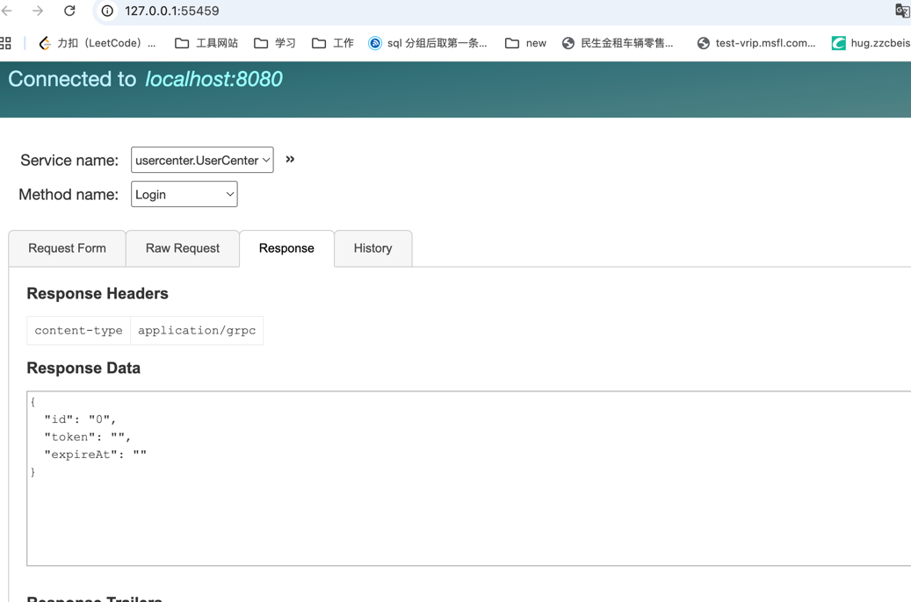

#### 新建项目
 1.用户中心api：
   gateway-api/api/user-center.api
   博客api:
      gateway-api/api/blog.api

 2.生成api
   `goctl api go -api *.api -dir=../ --style=goZero
   `
   注释： -dir 表示生成目录 ，--style 生成文件风格
 3. 添加jwt，

     **添加jwt 配置，**[gateway-api.yaml](gateway-api%2Fetc%2Fgateway-api.yaml)
    Auth:
    AccessSecret: "abc1233333"
    AccessExpire: 3600000
4. 注意上面生成的时候[routes.go](gateway-api%2Finternal%2Fhandler%2Froutes.go) 每次都会覆盖
如果同时生成两个api，**需要自行添加路由，最好api 模块分开，便于区分，同样types.go也有一样的问题**
4. 启动网关服务测试： go run gateway.go
5. rpc 服务启动与生成
 生成： goctl rpc protoc *.proto --go_out=./ --go-grpc_out=./  --zrpc_out=./ --style=goZero
6. rpc服务测试 安装grpcui `brew install grpcui`
   grpcui -plaintext localhost:8080
启动rpcserver， 端口用rpc端口 添加配置[user.yaml](user-rpc%2Fetc%2Fuser.yaml) 添加模式配置
测试： grpcui -plaintext localhost:8080
